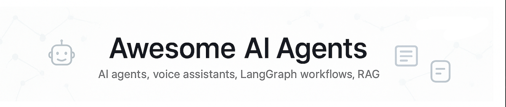

<p align="center">
  <a href="https://github.com/shahshrey/awesome-ai-agents">
    
  </a>
</p>

<p align="center">
  <a href="https://www.linkedin.com/in/shreyshahh/">
    
  </a>
  <a href="https://twitter.com/shreyshahh">
    
  </a>
</p>


<hr/>

# 🌟 Awesome AI Agents

A curated collection of **AI Agents, Voice Assistants, LangGraph workflows, and more** built with OpenAI, LangChain/LangGraph, and other cutting-edge tooling. Explore practical, production-ready agentic applications that you can run locally or deploy to the cloud.


## 🤔 Why Awesome AI Agents?

- 💡 **Discover** end-to-end reference implementations of autonomous agents that solve real-world problems.
- 🔥 **Learn** how to orchestrate multi-model pipelines, Retrieval-Augmented Generation (RAG), and voice interfaces.
- 🎓 **Level-up** your skills by reading well-documented codebases with clear separation of concerns and best practices.

## 📂 Featured AI Projects

### AGNO Agents

* [🦄 Mythical Creature Designer Agent](agno/mythical_creature_designer_agent/) – generates imaginative descriptions and lore for mythical creatures.
* [📄 Research Paper Agent](agno/research_paper_agent/) – assists with summarising, analysing, and citing research papers.

### LangGraph Workflows

* [🏢 Company Research Agent](langgraph/company_research_agent/) – performs deep-dive company analysis using LangGraph state machines.
* [🧠 Memory Agent (Simple)](langgraph/memory-agent_simple/) – demonstrates LangGraph memory primitives in a minimal chat agent.

### Voice Agents (OpenAI SDK)

* [🌙 Bed-time Story Agent](openai-sdk/voice-agents/bed_time_story_agent/) – tells interactive bedtime stories using speech-to-text & text-to-speech.
* [🍲 Recipe Helper Agent](openai-sdk/voice-agents/receipe_helper_agent/) – provides cooking guidance hands-free in the kitchen.
* [🔊 Voice RAG Agent](openai-sdk/voice-agents/voice-rag/) – retrieval-augmented voice assistant that answers questions about your documents.

## 🚀 Getting Started

1. **Clone the repository**

```bash
git clone https://github.com/shahshrey/awesome-ai-agents.git
```

2. **Navigate to the desired project directory**

```bash
cd awesome-ai-agents/agno/mythical_creature_designer_agent
```

3. **Install dependencies**

```bash
pip install -r requirements.txt
```

4. **Run the project**

Follow the `README.md` inside each sub-project for environment variables, command-line arguments, and usage examples.

## 🗺️ Repository Map

```text
agno/
  mythical_creature_designer_agent/   # Creative content generation agent
  research_paper_agent/               # Research assistant agent

langgraph/
  company_research_agent/             # Enterprise analysis using LangGraph
  memory-agent_simple/                # Minimal memory demonstration

openai-sdk/voice-agents/
  bed_time_story_agent/               # Voice storytelling agent
  receipe_helper_agent/               # Voice recipe assistant
  voice-rag/                          # Voice RAG assistant
```

## 🤝 Contributing

Contributions are welcome! Please open an issue or a pull request. When adding a new agent:

1. Place the code inside an appropriately named sub-folder.
2. Include a dedicated `README.md` covering setup, usage, and rationale.
3. Add unit tests and keep dependencies minimal.
4. Ensure your code passes linters (`ruff`, `black`) and type checks (`mypy`).

### ⭐ Show your support

If you find this repository useful, please star it – it motivates us to build more awesome agents!

[](https://star-history.com/#shahshrey/awesome-ai-agents&Date)

---
